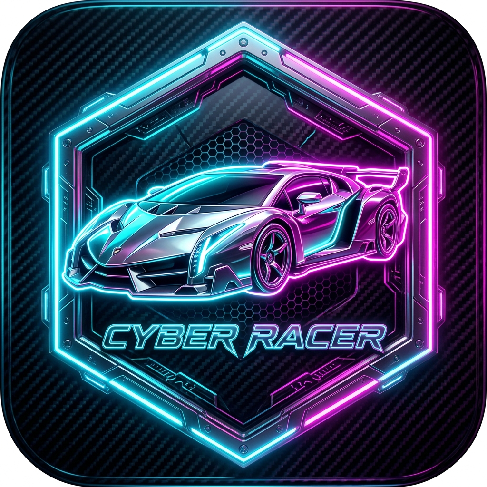
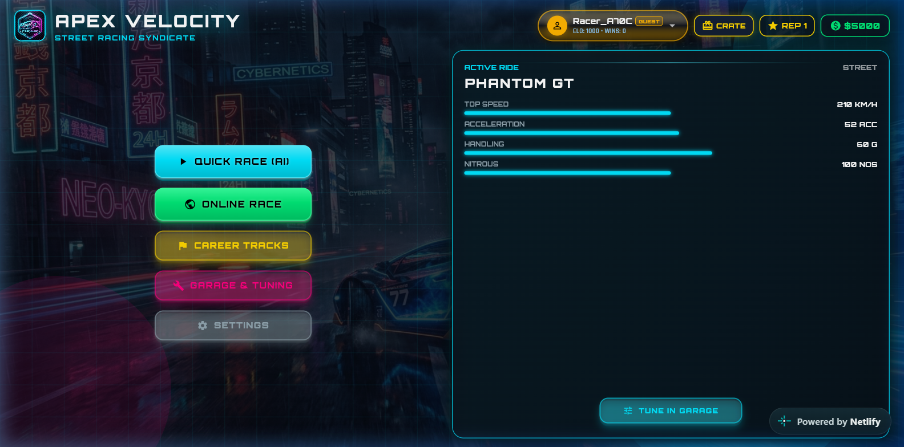
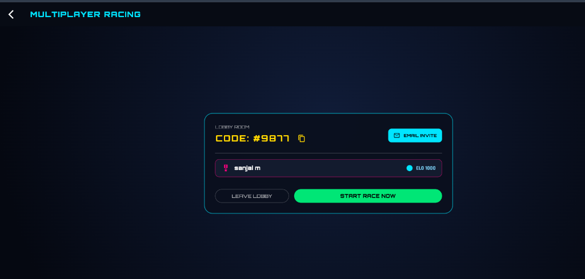
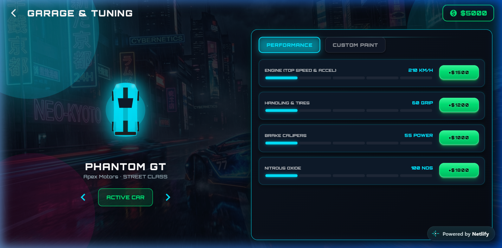
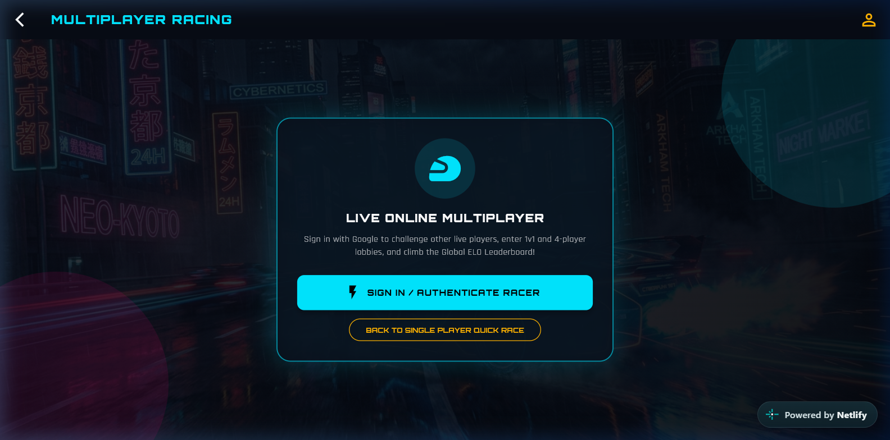
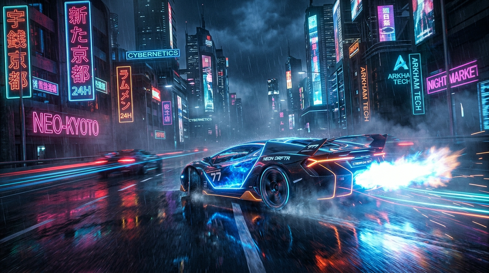

# 🏎️ Apex Velocity: Cyberpunk High-Speed Racing

<div align="center">



**A Next-Generation 2D/3D Cyberpunk High-Speed Arcade Racing Game built with Flutter & Flame Engine**

[](https://flutter.dev)
[](https://flame-engine.org)
[](https://apex-velocity-game.netlify.app)
[](https://apex-velocity-game.netlify.app)

[🌐 Play on Web](https://apex-velocity-game.netlify.app) • [📲 Download Android APK](https://tmpfiles.org/dl/wOwmpNg5KezE/app-release.apk)

</div>

---

## 📖 About The Game

**Apex Velocity** is an adrenaline-fueled cyberpunk arcade racing game crafted with Flutter and the Flame 2D game engine. Players pilot futuristic hypercars through neon-drenched cityscapes, dodge aggressive traffic, collect nitro boosts, and compete against friends and global players in real-time multiplayer races.

Designed from the ground up for a unified cross-platform experience:
- **On Web**: Full widescreen HD gameplay with desktop keyboard controls, responsive canvas rendering, and Google Web OAuth integration.
- **On Mobile (Android)**: Immersive landscape-locked gameplay with responsive touch controls, device rotation guard, and dedicated Android Google Sign-In.

---

## 📸 Visual Showcase & Screenshots

### 🌌 Main Menu & High-Speed Gameplay
| Main Menu (3D Emblem & Stats) | High-Speed Race Track & HUD |
| :---: | :---: |
|  |  |

### 🚗 Cyberpunk Garage & Real-Time Multiplayer
| Garage & Vehicle Customization | Real-Time Multiplayer Lobby |
| :---: | :---: |
|  |  |

### 🏎️ 3D Cinematic Artwork & Emblem
| 3D App Emblem | 3D Cinematic Hypercar Art |
| :---: | :---: |
|  |  |

---

## ✨ Key Features

### 🏎️ High-Speed Racing Mechanics
- **Physics-Driven Flame Game Engine**: Smooth 60+ FPS collision detection, acceleration curves, and obstacle generation.
- **Nitro Boost System**: Trigger high-velocity boost trails with dynamic camera shake and particle effects.
- **Procedural Obstacles & Traffic**: Dodge rival cars, oil slicks, and energy barriers that increase in speed and density.

### 🎨 Next-Gen 3D UI & Cyberpunk Aesthetics
- **3D Extruded Neon Buttons**: Physical push depth, specular sheen highlights, and vibrant neon glow feedback.
- **Layered 3D Glassmorphism Cards**: Stationary, rock-solid 3D depth with frosted glass backdrop filters and drop shadows.
- **Dynamic 3D Cinematic Background**: High-resolution 3D hypercar racing concept art integrated across all menus.
- **Animated 3D Splash Screen**: Camera zoom, pulsing logo glow, telemetry progress indicators, and smooth audio transitions.

### 🌐 Real-Time Multiplayer & Cloud Invitations
- **Low-Latency WebSocket Server**: Real-time position syncing, collision broadcasting, and live race timers.
- **Quick Race Matchmaking**: Jump instantly into public rooms matching live players.
- **Private Lobbies with Room Codes**: Create private 4-digit code rooms.
- **Automated Gmail SMTP Invitations**: Dispatch styled HTML email invitations with room codes and direct game links to friends directly from the lobby.

### 🔐 Cross-Platform Authentication
- **Dual Google OAuth 2.0 Integration**:
  - Dedicated **Web Application Client ID** for browser play.
  - Dedicated **Android Client ID** for native mobile devices.
- **Guest / Fast Play Mode**: Immediate access to single-player and multiplayer without mandatory login.

### 🎵 Adaptive Synthesizer Audio Engine
- **Generative Cyberpunk Synth Music**: Pure Dart procedural audio synthesizer producing retro-futuristic arcade soundtrack without external streaming dependencies.
- **Dynamic Sound Effects**: Engine revs, nitro activation, tire screeches, crash impacts, and countdown chimes.

### ☁️ Cloud Persistence (Neon Postgres)
- **Player Stats & Leaderboards**: Track personal best times, distance records, and global high scores.
- **Garage Unlocks**: Save unlocked hypercars, custom paint jobs, and performance upgrades across sessions.

---

## 🛠️ Tech Stack & Architecture

- **Frontend & Game Client**: [Flutter 3.x](https://flutter.dev) & [Flame Engine](https://flame-engine.org)
- **State & UI Framework**: Custom 3D Cyberpunk Design Tokens, Glassmorphism Widgets, Landscape Orientation Guard
- **Audio Engine**: Generative PCM Synthesizer + `audioplayers`
- **Backend & Networking**: Dart WebSocket Server (`bin/backend_server.dart`)
- **Email Infrastructure**: Gmail SMTP Protocol via `mailer`
- **Database**: [Neon Cloud PostgreSQL](https://neon.tech)
- **Deployment**: [Netlify](https://netlify.com) (Web CDN) & Release APK (Android)

---

## 🚀 Getting Started

### Prerequisites
- [Flutter SDK (3.x or higher)](https://docs.flutter.dev/get-started/install)
- [Dart SDK (3.x or higher)](https://dart.dev/get-dart)
- Android Studio / VS Code with Flutter extensions

### 1. Clone & Install Dependencies
```bash
git clone https://github.com/sanjai45-m/Solo-car.git
cd Solo-car
flutter pub get
```

### 2. Start the Backend Server (Optional for Multiplayer)
```bash
dart run bin/backend_server.dart
```

### 3. Run on Web
```bash
flutter run -d chrome
```

### 4. Run on Android Device / Emulator
```bash
flutter run -d android
```

### 5. Build Release Artifacts
```bash
# Web Production Build
flutter build web --release

# Android APK Production Build
flutter build apk --release
```

---

## 📥 Direct Downloads & Links

- 🌐 **Live Web Application**: [https://apex-velocity-game.netlify.app](https://apex-velocity-game.netlify.app)
- 📱 **Android Release APK**: [Download app-release.apk (55.2 MB)](https://tmpfiles.org/dl/wOwmpNg5KezE/app-release.apk)

---

## 📄 License
This project is developed for entertainment and portfolio demonstration purposes. All rights reserved.
